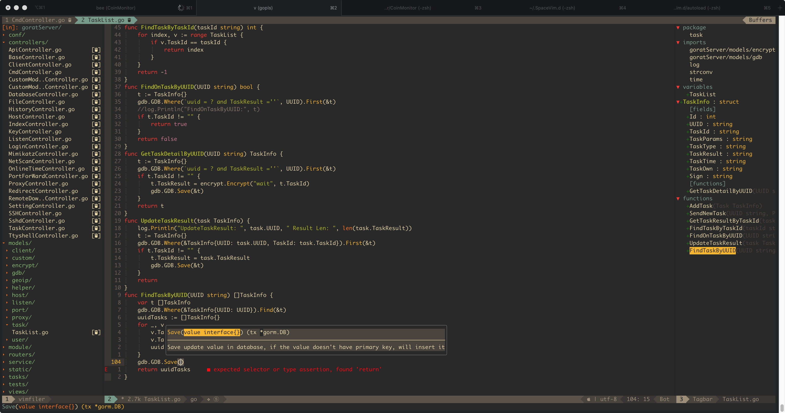

# SpaceVim.d


- [x] 缩进4空格
- [x] vimfiler在左边
- [x] lsp_signature函数提示
- [x] vim-go代码补全

```bash
go get -u github.com/mdempsky/gocode

vim:

:GoInstallBinaries

```

#
## 常用指令

| 键盘   | 物理案件 |
| ------ | -------- |
| Leader | \        |
| SPC    | 空格键         |

| 快捷键          | 指令               |
| --------------- | ------------------ |
| Leader + 数字   | 跳转到不同的tab    |
| SPC + 数字      | 跳转到不同的window |
| SPC b f         | 格式化代码         |
| SPC f v d       | 打开配置文件       |
| SPC l g         | 跳转到函数定义     |
| SPC l x         | 查看引用           |
| SPC b d         | 关闭当前buff       |
| SPC f t         | 顯示、隱藏文件樹   |
| SPC f f         | 打开fzf搜索窗口    |
| SPC f o         | 打开当前文件所在文件夹位置| 
| SPC s r p       | rg全局搜索内容     |
| SPC s j/J       | 全局搜索内容       |
| SPC l k/K       | 给结构体加/取消json |
| Ctrl-Shift-Up   | 向上移动当前行     |
| Ctrl-Shift-Down | 向下移动当前行     |
| F3              | 隐藏tabbar         |
| sg              | 文件树中左右分割展示 |
| sv              | 文件树中上下分割展示 |
| ctrl+r          | 文件树中刷新文件列表 |
| N               | 文件树中当前位置新建文件|

| 快捷键 | 含义                           |
| ------ | ------------------------------ |
| w/W    | 下一单词                       |
| b/B    | 前一单词                       |
| e/E    | 词尾                           |
| >      | 缩进                           |
| <      | 删除缩进                       |
| G      | 文件末端                       |
| gg     | 文件头部                       |
| a      | 当前光标后方插入               |
| A      | 当前行尾插入                   |
| i      | 当前光标前方插入               |
| o      | 当前行后插入新行               |
| C/cc   | 清空当前行,可带反向参数        |
| dd     | 删除当前行                     |
| D      | 删除当前字符串后面的           |
| daw    | 删除当前单词                   |
| diw    | 删除当前单词并包含最后一个空格 |
| :noh   | 取消搜索高亮                   |
| y      | v模式下复制                    |	
| Leader + y| 复制到系统剪切板            |

